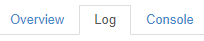
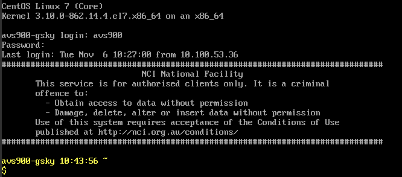
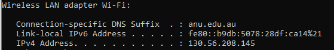
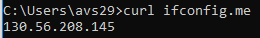

INTRODUCTION
============

This document describes how to create an instance of Virtual Machine (VM) on tenjin.nci.org.au and to build the GSKY environment on it. If you have already set it up once, then you may require only the short instructions given below. To refresh memory, read the **TL;DR** section or the detailed instructions.

CONTENTS
========

- Short Instructions
	- Build a Virtual Machine
	- Build the GSKY environment
	- Create the configuration file(s)
	- Run and test the GSKY server
- Detailed Instructions
	- Build a Virtual Machine
	- Create an SSH key pair
	- Build the GSKY environment
	- Create the configuration file(s)
	- Run and test the GSKY server
- Components and Commands
	- sudo -i
	- build_all.sh
	- yum groupremove "Development Tools"
	- yum groupinstall "Development Tools"
	- yum install wget
	- yum install cmake
	- yum install python-devel
	- yum install readline-devel
	- Specific Dependencies
		- 	Independent JPEG Group's free JPEG software
		- 	OPENJPEG Library and Applications
		- 	GEOS - Geometry Engine, Open Source
		- 	Cartographic Projection Procedures for the UNIX Environment
		- 	Zlib Data Compression Library
		- 	Hierarchical Data Format (HDF4)
		- 	Hierarchical Data Format (HDF5)
		- 	Network Common Data Form (NetCDF)
		- 	XML C parser
		- 	JSON-C - A JSON implementation in C
		- 	Geospatial Data Abstraction Library (GDAL)
		- 	PostgreSQL Relational Database
		- 	PostGIS: Spatial database extender
		- 	GO Programming Language
		- 	Build GSKY binary
		- 	Install the GSKY binaries	

TL;DR
=====
- Create a VM instance on tenjin.nci.org.au.
	- Choose the option that gives at least 4GB RAM and 80GB disk.
	- Choose CentOS 7 as the operating system.
	- Remember that the VM is accessible only from within NCI network.
	- Use the ethernet for connection when in the office.
	- WiFi through ANU-Secure will not connect to the VM, unless your PC’s IP is added to its firewall.
	- Use VPN to connect from remote locations or from within the office when using the WiFi.
- The GSKY environment must be setup on each new VM.
	- See the short instructions for quick start.
	- See the detailed instructions for components and trouble shooting.
- It takes about 30 minutes to complete, if there are no errors.
	- Ignore the warning messages during the installation.
	- Pay attention to error (crash) and exit messages.
	- If no error, it will display “Completed ALL steps. Exiting!” at the end.
	- Sometimes, after the completion of installation it displays "Segmentation Fault"
		- As yet unsure if it causes any error downstream.
- Sometimes the script crashes for no apparent reason.
	- Re-starting often works to completion.
- Sometimes the OS causes consistent errors during the installation.
	- Re-build the VM with the same OS, and it works.

SHORT INSTRUCTIONS
==================

Build a Virtual Machine
------------
- Go to: https://tenjin.nci.org.au/dashboard/auth/login/
- Login with your NCI username and password.
	- Instances >> Launch Instance >> Specify Parameters >> Launch
	- Wait at least 10 minutes for the VM setup to complete.

Build the GSKY environment
----------
- Login to the VM via SSH
- Transfer ‘build_all.sh’ to the home dir.
- cd ~
- chmod 755 build_all.sh
- sudo ./build_all.sh

Do the following if ‘build_all.sh’ is not provided.
- git clone https://github.com/nci/gsky.git
- cp gsky/install/build_all.sh ~

Create the configuration file(s)
--------------------------------
- cd /usr/local/etc
- Create or copy a [config.json](config.json) in the above directory or sub-directories.
- Insert your server's IP in: "ows_hostname": "OWS_IP_ADDRESS"

Run and test the GSKY server
----------------------------
- sudo /local/gsky/share/gsky/gsky -p 80&
- Open http://130.56.242.16/terria/
- Add Data >> My Data >> Add Web Data >> http://130.56.242.xx/ows >> Add

TIPS AND TRICKS
==============
- The following environment variable is required to start the OWS server.
	- export LD_LIBRARY_PATH=/usr/local/lib:/usr/lib

- The files are created in /usr/local/share/gsky, but the server looks for them in /usr/local/share/gsky
	- ```ln -s /local/gsky/share/gsky /usr/local/share/gsky```

- A running OWS server must be killed before starting another.
	```	
		pid=`ps -ef | grep gsky | grep -v grep | awk '{split($0,a," "); print a[2]}'`
		kill $pid
	```
- Start an OWS server as...
	- /local/gsky/share/gsky/gsky -p 80&
	- /local/gsky/share/gsky/gsky --conf_dir=/local/gsky/share/gsky -p 80&
	
- Must kill and restart the OWS server if config.json is edited or added.

- The 'Add Web Data' URL on http://130.56.242.16/terria/ must NOT have the ending slash.
	- http://130.56.242.19/ows - Correct
	- http://130.56.242.19/ows/ - Incorrect

- The layers will only be seen on the map at a zoom level of 20 km per inch or higher.
	
------------------

DETAILED INSTRUCTIONS
==================

Build a Virtual Machine
-------------------------

The VM instances on https://tenjin.nci.org.au are where the GSKY installation and servers are built and managed.

- Go to https://tenjin.nci.org.au/dashboard/project/
	- Click on ‘Instances’ and then on ‘Launch Instance’


 

- Fill in details as per the example below.

 

- Create/choose a key pair if you wish to use it for password-less login. Otherwise, leave it as blank.
	- Click the + icon to create a new key pair.
	
 

- Create the instance by clicking ‘Launch’

 

- Wait 10 min for the installation to complete.
- Click on the instance name below (e.g. siva-gsky).

 

- Click the 'log' tab below.

 

- Verify that the last line says, "Cloud-init v. x.x.x finished at ..."

 - Click on ‘Console’ tab and then on the hypertext link, "Click here to show only console"
 
 

 

- Login with NCI username/password when prompted. 
	- This is now a regular VM console.

 

**Accessing the VM from your workstation**

You can imediately SSH to the VM if you are on the NCI network, either through ethernet or VPN.

Must add your IP address to the VM's iptables if your workstation is on a private network, including the 'ANU-Secure' WiFi network.

- Find your IP addres
- Open a command window on PC (Windows)
	- ipconfig
	
	
	
	- or 'curl ifconfig.me'
	
	
	
		- sudo -i
		- cd /etc/puppetlabs/code/environments/production/hieradata/node/
		- cat > [vm name].yaml (e.g. siva-gsky.yaml)
			- insert the following.
			- nci::firewall::ruleset::ssh::sources_array:
			- – “130.56.84.195” 
				- Tip: Find your IP address:
					- ipconfig (Windows IPv4 address) 
					- ifconfig | awk '/inet / {print}' in Linux
		- OR 
			- vim siva-gsky.yaml
			- Change the IP address to your own as per the example below.
				- – “130.56.84.195”
		- puppet-apply
		- iptables –list

Create an SSH key pair
=================
NOTE: You will only need this if intending to login and/or transfer files between the VM and another Unix server. There is not much use of it under Microsoft Windows, as ‘putty’ and ‘winscp’ cannot use the openssh keys. Converting them to putty key (*.ppk) does not work either, as the VM does not recognise it. 

**To create:**

- SSH to your “home machine”
	- ssh-keygen -t rsa -f username.key
- Copy the content of ‘username.key.pub’ and paste it into the box.
- Keep the ‘username.key’ safely and securely.
-------------------

Build the GSKY environment
--------------------------

In order to run an OWS server, it is required to install GSKY and its dependencies on the VM. This step is required on each new VM being created.

-	Install the dependencies and GSKY environment.
-	Use the 'build_all.sh' provided or clone the git repo from below.
	- copy the ‘build_all.sh’ to the home dir.
	- cd ~
	- sudo ./build_all.sh
OR, clone it under your username so that files can be edited by yourself.
-	cd ~
-	git clone https://github.com/nci/gsky.git
	- cp gsky/install/build_all.sh ~
	- sudo ./build_all.sh

This will take several minutes to complete. It is normal to see many warning messages. Ignore the warnings, but make sure that there is no fatal error. If installation goes to completion, it will display “Completed ALL steps. Exiting”

COMPONENTS AND COMMANDS
-----------------------

- **sudo -i**

This command starts a super user session using the current shell (e.g. /bin/bash) so that all system commands can be run without having to do a ‘sudo command’ every time. This method, however, has the disadvantage that you are now not in your username’s login shell and therefore the environments, aliases, etc. for your shell are not available. Another risk is that now you are a super user and can accidentally delete/modify things you could not have done before. The safe way is to use ‘sudo command’. For this, avoid the ‘sudo -i’ and prepend ‘sudo’ to all the commands shown below.

- **build_all.sh**

This script installs several dependencies as given below. It is required to run this script only once.

- **yum groupremove "Development Tools"**

Remove the previously installed programs, if any, so that the latest versions will be installed.

- **yum groupinstall "Development Tools"** [[Ref](https://serverfault.com/questions/274279/whats-the-difference-between-yum-groupinstall-vs-regular-yum-install)]

The groupinstall command installs packages that are designated as a group so that you don't need to install a large number of individual packages yourself to have all of the features. So, yum groupinstall "Development Tools" would install all packages necessary for development, such as gcc, make, git, etc.

'yum grouplist' will list the possible groups. 'yum groupinfo groupname' will show what packages are members of groupname (you will need quotes if there are spaces in the group name).

The regular 'yum install' just installs individual packages (and their dependencies) by name.

The following programs are not part of the “groupinstall Development Tools” and, therefore, must be installed separately.

- **yum install wget**
The program, ‘wget’, is used to download several packages required for GSKY. 

- **yum install cmake**
cmake - Cross-Platform Makefile Generator.

- **yum install python-devel**
An include file, Python.h’, is required. It comes from this package.

- **yum install readline-devel**
This is required for PostGreSQL installation.

After the above common dependencies are installed, we must install the following dependencies that are specific for GSKY.

--------------
- **1.	Independent JPEG Group's free JPEG software** [[Ref](http://www.ijg.org/files/README)]

```
prefix=${PREFIX:-/usr}
v=9c
(
	set -xeu
	wget -q http://www.ijg.org/files/jpegsrc.v${v}.tar.gz
	tar -xf jpegsrc.v${v}.tar.gz
	cd jpeg-${v}
	./configure --prefix="$prefix"
	make -j4
	make install
)
rm -rf jpeg-${v}
rm -f jpegsrc.v${v}.tar.gz
```

This package contains the C software to implement JPEG image encoding, decoding, and transcoding.  JPEG is a standardized compression method for full-colour and grayscale images.

The distributed programs provide conversion between JPEG JFIF format and image files in PBMPLUS PPM/PGM, GIF, BMP, and Targa file formats.  The core compression and decompression library can easily be reused in other programs, such as image viewers.  The package is highly portable C code; we have tested it on many machines ranging from PCs to Crays. jpegsrc.vN.tar.gz contains source code, documentation, and test files for release N in Unix format.

------------

- **2.	OPENJPEG Library and Applications** [[Ref](https://github.com/uclouvain/openjpeg/blob/master/README.md)]

```
v=2.3.0
(
	set -xeu
	wget -q -O openjpeg-v${v}.tar.gz https://github.com/uclouvain/openjpeg/archive/v${v}.tar.gz
	tar -xf openjpeg-v${v}.tar.gz
	cd openjpeg-${v}
	mkdir build
	cd build
	cmake .. -DCMAKE_BUILD_TYPE=Release -DCMAKE_INSTALL_PREFIX="$prefix"
	make -j4
	make install
)
rm -rf openjpeg-${v}
rm -f openjpeg-v${v}.tar.gz
```

OpenJPEG is an open-source JPEG 2000 codec written in C language. It has been developed in order to promote the use of JPEG 2000, a still-image compression standard from the Joint Photographic Experts Group (JPEG). Since April 2015, it is officially recognized by ISO/IEC and ITU-T as a JPEG 2000 Reference Software.

```NOTE: The download link appears to get an older version that has been archived. Their latest release has a different tar structure. It is not known whether we specifically need the presumably older release.```

------------

- **3.	GEOS - Geometry Engine, Open Source** [[Ref](https://www.osgeo.org/projects/geos/)]
 
```
v=3.6.2
(
	set -xeu
	wget -q http://download.osgeo.org/geos/geos-${v}.tar.bz2
	bunzip2 geos-${v}.tar.bz2
	tar -xf  geos-${v}.tar
	cd geos-${v}
	./configure --prefix="$prefix"
	make -j4
	make install
)
rm -rf geos-${v}
rm -f geos-${v}.tar
```

**GEOS (Geometry Engine - Open Source)** is a C++ port of the Java Topology Suite (JTS). As such, it aims to contain the complete functionality of JTS in C++. This includes all the OpenGIS Simple Features for SQL spatial predicate functions and spatial operators, as well as specific JTS enhanced topology functions.

**Capabilities**

-	Geometries: Point, LineString, Polygon, MultiPoint, MultiLineString, MultiPolygon, GeometryCollection
-	Predicates: Intersects, Touches, Disjoint, Crosses, Within, Contains, Overlaps, Equals, Covers
-	Operations: Union, Distance, Intersection, Symmetric Difference, Convex Hull, Envelope, Buffer, Simplify, Polygon Assembly, Valid, Area, Length,
-	Prepared geometries (pre-spatially indexed)
-	STR spatial index
-	OGC Well Known Text (WKT) and Well-Known Binary (WKB) encoders and decoders.
-	C and C++ API (C API gives long term ABI stability)
-	Thread safe (using the re-entrant API)

`NOTE: The v3.6.2 being downloaded in the script is an older version (2017). Latest stable release is 3.7.0 (Sep 2018)`

------------

- **4.	Cartographic Projection Procedures for the UNIX Environment** [[Ref](http://download.osgeo.org/proj/OF90-284.pdf)]

```
v=5.1.0
vd=1.7
(
	set -xeu
	wget -q http://download.osgeo.org/proj/proj-${v}.tar.gz
	tar -xf proj-${v}.tar.gz
	wget -q http://download.osgeo.org/proj/proj-datumgrid-${vd}.zip
	unzip proj-datumgrid-${vd}.zip -d proj-${v}/nad/
	cd proj-${v}
	./configure --prefix="$prefix"
	make -j4
	make install
)
rm -rf proj-${v}
rm -f proj-${v}.tar.gz*
rm -f proj-datumgrid-${vd}.zip
```
Program proj (release 3) is a standard Unix filter function which converts geographic longitude and latitude coordinates into cartesian coordinates, (λ, φ) → (x, y), by means of a wide variety of cartographic projection functions. For many of the projection functions the inverse conversion, (x, y) → (λ, φ), can also be performed.

`NOTE: The v5.1.0 being downloaded in the script is an older version (2017). Latest stable release is v5.2.0 (Sep 2018)`

------------

- **5.	Zlib Data Compression Library** [[Ref](https://en.wikipedia.org/wiki/Zlib)]

```
v=1.2.8
(
	set -xeu
	wget -q ftp://ftp.unidata.ucar.edu/pub/netcdf/netcdf-4/zlib-${v}.tar.gz
	tar -xf zlib-${v}.tar.gz && cd zlib-${v}
	./configure --prefix="$prefix"
	make -j4
	make install
)
rm -rf zlib-${v}
rm -f zlib-${v}.tar.gz
```
zlib 1.2.8 is a general-purpose data compression library.  All the code is thread safe.  The data format used by the zlib library is described by RFCs (Request for Comments) 1950 to 1952 in the files http://tools.ietf.org/html/rfc1950 (zlib format), rfc1951 (deflate format) and rfc1952 (gzip format).

zlib compressed data are typically written with a gzip or a zlib wrapper. The wrapper encapsulates the raw deflate data by adding a header and trailer. This provides stream identification and error detection that are not provided by the raw deflate data.

------------

- **6.	Hierarchical Data Format (HDF4)** [[Ref](https://www.hdfgroup.org/solutions/hdf4/)]

```
v=4.2.13
(
	set -xeu
	wget -q https://support.hdfgroup.org/ftp/HDF/HDF_Current/src/hdf-${v}.tar.gz
	tar -xf hdf-${v}.tar.gz
	cd hdf-${v}
	./configure --enable-shared --disable-fortran --prefix="$prefix"
	make -j4
	make install
)
rm -rf hdf-${v}
rm -f hdf-${v}.tar.gz
```
HDF4 is a library and multi-object file format for storing and managing data between machines. HDF4 is a very different technology than HDF5. The HDF Group recommends that, other than for working with existing HDF4 data, new applications use HDF5 since HDF5 addresses important deficiencies of HDF4.

If you’re interested in converting your data from HDF4 to HDF5, our engineers can help. Learn more about our consulting service or free and open source h4toh5 conversion tools.

NASA maintains a network of Earth Observing Satellites that transmit huge volumes of new imagery data daily in HDF4.  As a result, HDF4 is used extensively in the Earth Sciences. The HDF-EOS Website, http://www.hdfeos.org has a wealth of information on these uses.

`NOTE: We are using both HDF4 and HDF5 (see below)`

------------

- **7.	Hierarchical Data Format (HDF5)** [[Ref](https://support.hdfgroup.org/HDF5/Tutor/HDF5Intro.pdf)]

```
v=1.8.13
(
	set -xeu
	wget -q ftp://ftp.unidata.ucar.edu/pub/netcdf/netcdf-4/hdf5-${v}.tar.gz
	tar -xf hdf5-${v}.tar.gz && cd hdf5-${v}
	./configure --enable-shared --enable-hl --prefix="$prefix"
	make -j4
	make install
)
rm -rf hdf5-${v}
rm -f hdf5-${v}.tar.gz
```
Hierarchical Data Format 5 (HDF5) is a unique open source technology suite for managing data collections of all sizes and complexity. HDF5 was specifically designed: 
- For high volume and/or complex data (but can be used for low volume/simple data) 
- For every size and type of system (portable) 
- For flexible, efficient storage and I/O 
- To enable applications to evolve in their use of HDF5 and to accommodate new models 
- To be used as a file format tool kit (many formats use HDF5 under the hood)

------------

- **8.	Network Common Data Form (NetCDF)** [[Ref](https://www.unidata.ucar.edu/downloads/netcdf/index.jsp)]

```
v=4.1.3
(
	set -xeu
	wget -q http://www.unidata.ucar.edu/downloads/netcdf/ftp/netcdf-${v}.tar.gz
	tar -xf netcdf-${v}.tar.gz && cd netcdf-${v}
	./configure --enable-netcdf-4 --enable-shared --enable-dap --prefix="$prefix"
	make -j4
	make install
)
rm -rf netcdf-${v}
rm -f netcdf-${v}.tar.gz
```
NetCDF (network Common Data Form) is a set of software libraries and machine-independent data formats that support the creation, access, and sharing of array-oriented scientific data. Distributions are provided for Java and C/C++/Fortran. See the netCDF web site and the FAQ answer to How do I get the netCDF software package? for more information.

------------

- **9.	XML C parser** [[Ref](http://xmlsoft.org/)]

```
v=2.9.8
(
	set -xeu
	wget -q ftp://xmlsoft.org/libxml2/libxml2-${v}.tar.gz
	tar -xf libxml2-${v}.tar.gz
	cd libxml2-${v}
	./configure --prefix="$prefix"
	make -j4
	make install
)
rm -rf libxml2-${v}
rm -f libxml2-${v}.tar.gz
```
Libxml2 is the XML C parser and toolkit developed for the Gnome project (but usable outside of the Gnome platform), it is free software available under the MIT License. XML itself is a metalanguage to design markup languages, i.e. text language where semantic and structure are added to the content using extra "markup" information enclosed between angle brackets. HTML is the most well-known markup language. Though the library is written in C a variety of language bindings make it available in other environments.

------------

- **10.	JSON-C - A JSON implementation in C** [[Ref](https://github.com/json-c/json-c/blob/master/README.md)]

```
v=0.13.1
(
	set -xeu
	wget -q https://s3.amazonaws.com/json-c_releases/releases/json-c-${v}.tar.gz
	tar -xf json-c-${v}.tar.gz
	cd json-c-${v}
	./configure --prefix="$prefix"
	make -j4
	make install
)
rm -rf json-c-${v}
rm -f json-c-${v}.tar.gz
```
JSON-C implements a reference counting object model that allows you to easily construct JSON objects in C, output them as JSON formatted strings and parse JSON formatted strings back into the C representation of JSON objects. It aims to conform to RFC 7159.

------------

- **11.	Geospatial Data Abstraction Library (GDAL)** [[Ref](https://en.wikipedia.org/wiki/GDAL)]

```
v=2.3.1
(
	set -xeu
	wget -q http://download.osgeo.org/gdal/${v}/gdal-${v}.tar.gz
	tar -xf gdal-${v}.tar.gz
	
	# Location of the openjpeg libraries.
	include=/usr/include
	
	# Find out where the openjpeg libraries are. 
	# This step is for safety, as sometimes the libraries are in /include 
	res=`find /. -name libopenjp2.pc`
	if [ $res ]
	then
		p=${res/libopenjp2.pc/}
		p=${p/./}
		export PKG_CONFIG_PATH=$p
		q=`/usr/bin/pkg-config libopenjp2 --cflags`
		r=${q/\/openjpeg*/}
		include=${r/-I/}
	fi
	
	cd gdal-${v}
	./configure --with-geos=yes --with-netcdf --with-openjpeg=$include
	make -j4
	make install
)
rm -rf gdal-${v}
rm -f gdal-${v}.tar.gz
```

The Geospatial Data Abstraction Library (GDAL) is a computer software library for reading and writing raster and vector geospatial data formats, and is released under the permissive X/MIT style free software license by the Open Source Geospatial Foundation. As a library, it presents a single abstract data model to the calling application for all supported formats. It may also be built with a variety of useful command line interface utilities for data translation and processing. Projections and transformations are supported by the PROJ.4 library.

------------

- **12.	PostgreSQL Relational Database** [[Ref](https://www.postgresql.org/about/)}

```
v=11.0
(
	set -xeu
	wget -q https://ftp.postgresql.org/pub/source/v${v}/postgresql-${v}.tar.gz
	tar -xf postgresql-${v}.tar.gz
	cd postgresql-${v}
	./configure
	make
	make install
)
rm -rf postgresql-${v}
rm -f postgresql-${v}.tar.gz*

# Check and create the user 'postgres'
s1=`id -u postgres`
if [ $s1 ]
then
	echo "User, 'postgres', exists. Nothing to do!"
else
	echo "Creating the user!"
	adduser postgres
fi
mkdir -p /var/lib/pgsql
mkdir -p /usr/local/pgsql/data
chown postgres /usr/local/pgsql/data
su - postgres -c '/usr/local/pgsql/bin/initdb -D /usr/local/pgsql/data; /usr/local/pgsql/bin/postgres -D /usr/local/pgsql/data >/tmp/logfile 2>&1 &'
```

PostgreSQL is a powerful, open source object-relational database system that uses and extends the SQL language combined with many features that safely store and scale the most complicated data workloads. The origins of PostgreSQL date back to 1986 as part of the POSTGRES project at the University of California at Berkeley and has more than 30 years of active development on the core platform.

`PostgreSQL and PostGIS (see below) must be installed, via source compilation, AFTER the GEOS and GDAL installations. Though these can be installed with ‘yum install’, it will not link correctly with GDAL.`

------------

- **13.	PostGIS: Spatial database extender** [[Ref](https://postgis.net/)]

PostGIS is a spatial database extender for PostgreSQL object-relational database. It adds support for geographic objects allowing location queries to be run in SQL. In addition to basic location awareness, PostGIS offers many features rarely found in other competing spatial databases such as Oracle Locator/Spatial and SQL Server. Refer to PostGIS Feature List for more details.

```
v=2.5.0
(
	set -xeu
	wget -q https://download.osgeo.org/postgis/source/postgis-${v}.tar.gz
	tar xf postgis-${v}.tar.gz
	cd postgis-${v}
	./configure --with-pgconfig=/usr/local/pgsql/bin/pg_config
	make
	make install
)
rm -f postgis-${v}.tar.gz*
rm -rf postgis-${v}
```

`PostGIS requires GEOS and GDAL (see below for all dependencies). Hence it must be installed after GEOS, GDAL and PostgreSQL.`

```
-------------- Dependencies --------------
  GEOS config:          /usr/bin/geos-config
  GEOS version:         3.6.2
  GDAL config:          /usr/local/bin/gdal-config
  GDAL version:         2.3.1
  PostgreSQL config:    /usr/local/pgsql/bin/pg_config
  PostgreSQL version:   PostgreSQL 11.0
  PROJ4 version:        51
  Libxml2 config:       /usr/bin/xml2-config
  Libxml2 version:      2.9.8
  JSON-C support:       yes
  protobuf-c support:   no
  PCRE support:         no
  Perl:                 /usr/bin/perl
```

-------------

- **14.	GO Programming Language** [[Ref](https://en.wikipedia.org/wiki/Go_(programming_language))]

Go (often referred to as Golang) is a programming language designed by Google. Go is a statically typed, compiled language in the tradition of C, with the added benefits of memory safety, garbage collection, structural typing and CSP-style concurrency. The compiler, tools, and source code are all free and open source.

```
echo "14. Install GO"
set -xeu
prefix=/local/gsky
mkdir -p $prefix

rm -rf $prefix/gopath
mkdir $prefix/gopath

rm -rf $prefix/bin
mkdir $prefix/bin

C_INCLUDE_PATH=$(/usr/bin/nc-config --includedir)
export C_INCLUDE_PATH

wget -q -O go.tar.gz https://dl.google.com/go/go1.10.3.linux-amd64.tar.gz
tar -xf go.tar.gz
rm -rf go.tar.gz

rm -rf $prefix/go
mv go $prefix/go
```

The ‘go’ executable will be installed in /local/gsky/go/bin. Add it to your PATH to run from command line. This step is not required.

- export PATH=$PATH:/local/gsky/go/bin

-------------

- **15.	Build GSKY binary**

The GSKY source files are in the Github repo, ‘https://github.com/nci/gsky’. They are first cloned into /local/gsky/gopath/src/github.com before building the GSKY binary.

```
echo "15. Compile GSKY"
repo=asivapra
(
	set -xeu
	prefix=/local/gsky
	export GOROOT=$prefix/go
	export GOPATH=$prefix/gopath
	export PATH="$PATH:$GOROOT/bin"
	export PKG_CONFIG_PATH=/usr/local/lib/pkgconfig

	go get github.com/${repo}/gsky
	rm -rf $GOPATH/src/github.com/${repo}/gsky
	git clone https://github.com/${repo}/gsky.git $GOPATH/src/github.com/${repo}/gsky
	set -xeu
	cd $GOPATH/src/github.com/${repo}/gsky
	./configure
	make all
)	
```

-------------

- **16.	Install the GSKY binaries**

This step involves just copying the files into the right directories.
-	/local/gsky/bin/api*
-	/local/gsky/share/gsky/gsky*
-	/local/gsky/share/gsky/grpc_server*
-	/local/gsky/share/gsky/gsky-gdal-process*

```
echo "16. Copy all files to final locations"
(
	set -xeu
	prefix=/local/gsky	
	export GOPATH=$prefix/gopath
	rm -rf $prefix/share
	mkdir -p $prefix/share/gsky
	mkdir -p $prefix/share/mas
	yes|cp -f $GOPATH/src/github.com/${repo}/gsky/concurrent $prefix/bin/concurrent
	yes|cp -f $GOPATH/bin/api $prefix/bin/api
	yes|cp -f $GOPATH/bin/gsky $prefix/share/gsky/gsky
	yes|cp -f $GOPATH/bin/grpc-server $prefix/share/gsky/grpc_server
	yes|cp -f $GOPATH/bin/gdal-process $prefix/share/gsky/gsky-gdal-process
	yes|cp -f $GOPATH/bin/crawl $prefix/share/gsky/gsky-crawl
	yes|cp -f $GOPATH/src/github.com/${repo}/gsky/crawl/crawl_pipeline.sh $prefix/share/gsky/crawl_pipeline.sh
	yes|cp -f $GOPATH/src/github.com/${repo}/gsky/mas/db/* $prefix/share/mas/		
	yes|cp -rf $GOPATH/src/github.com/${repo}/gsky/*.png $prefix/share/gsky/
	yes|cp -rf $GOPATH/src/github.com/${repo}/gsky/templates $prefix/share/gsky/
	yes|cp -rf $GOPATH/src/github.com/${repo}/gsky/static $prefix/share/gsky/
	rm -rf /local/gsky_temp
	mkdir -p /local/gsky_temp
	chown -R nobody:nobody /local/gsky_temp
)
echo "**** Finished installing the GSKY server. **** "
```
-------------

- **17. Start the OWS server**
```
prefix=/local/gsky
echo "Put a soft link to find the /usr/local/share/gsky"
if [ ! -L /usr/local/share/gsky ] 
then
	ln -s /local/gsky/share/gsky /usr/local/share/gsky
fi

if [ ! -f $prefix/share/gsky/config.json ] 
then
	echo "Creating a sample config.json"	
	input=$home/gsky/install/config.json
	ip=`curl ifconfig.me`
	while IFS= read -r var
	do
	  line=${var/OWS_IP_ADDRESS/$ip}
	  echo "$line" >> $prefix/share/gsky/config.json
	done < "$input"
fi	
echo "Create a soft link to the config.json from /usr/local/etc"
if [ ! -L /usr/local/etc/config.json ] 
then
	ln -s $prefix/share/gsky/config.json /usr/local/etc/config.json
fi
```
- **18. Start the OWS server**
```
echo "Start the OWS server"
export LD_LIBRARY_PATH=/usr/local/lib:/usr/lib

# Kill an already ruunig server, if any.
pid=`ps -ef | grep gsky | grep -v grep | awk '{split($0,a," "); print a[2]}'`
kill $pid

# Start the server
/local/gsky/share/gsky/gsky -p 80&
```

Create the configuration file(s)
--------------------------------
The configuration file is what describes the data, such as data source, title, date, description, etc. There must be one file for each source dataset and must be named as 'config.json'. There can be several config.json files in sub-directories of a project.

```
e.g.
Project
	config.json
	- Subdir1
		config.json
	- Subdir2
		config.json
		- Subdir3
			config.json
```
The config.json has the following keys:

- service_config
	- Specifies the IP addresses of the main server ('OWS'), the MAS server and the worker nodes.
- layers
	- Each layer describes a dataset. 
	- There can be more than one layer in a config file.

```
{
  "service_config": {
    "mas_address": "10.0.1.210:8888",
    "worker_nodes": [
        "10.0.1.190:6000",
        "10.0.1.192:6000"
    ],
    "ows_hostname": "OWS_IP_ADDRESS"
  },
  "layers": [
    {
      "step_days": 16,
      "abstract": "This product has been corrected to remove the influences of the atmosphere..  ",
      "start_isodate": "2013-03-01T00:00:00.000Z",
      "clip_value": 2500,
      "data_source": "/g/data2/rs0/datacube/002/LS8_OLI_NBAR",
      "offset_value": 0,
      "rgb_products": [
        "red",
        "green",
        "blue"
      ],
      "name": "LS8:NBAR:TRUE",
      "title": "DEA Landsat 8 surface reflectance true colour",
      "scale_value": 0.1016,
      "time_generator": "regular",
      "accum": true,
      "end_isodate": "mas",
      "zoom_limit": 500
    },
    {
      "title": "Next layer",
    },
    {
      "title": "Next layer",
    }
   ]
 }
```
Troubleshooting
===============

- **VM is not created**

If you choose more CPUs and/or RAM than what are available, the system will refuse to create the VM. For the GSKY server, 4 CPUs, 8GB RAM and 40GB disk are recommended. Though you can install GSKY on a VM with 1 CPU and 2GB RAM, the operations could be slower. 

- **VM becomes unresponsive**

This is not a frequent event, but occasionally a newly created VM may never finish installing the OS and/or become unresponsive to every action including the deletion of the instance. If so, contact the Helpdesk (help@nci.org.au) to delete the instance and start over. 

- **Building GSKY gives an error**

Occasionally, the OS for the VM is not properly installed and it results in an error at some point (specifically, with PostGIS). If the error occurs everytime at the same step in build_all.sh, then delete the VM and recreate another instance. It seems to work after re-creating the VM.

- **The build_all.sh crashes at different points**

Due to some quirk with the OS, the script sometimes crashes with strange messages like, 'stall not found', etc. It appears that a command in the script gets mutilated during execution (hence, 'stall' instead of 'install'). Re-starting the script often solves it.

- **Segmentation Fault**

This message appears sometimes, even though the script has run to completion and everything has been installed correctly. Unsure what it means or its impact on downstream operations. It too appears to be related to a [possibly] faulty VM installation. It is best to redo the VM installation until the error does not happen.

- **Error starting the OWS server**

The URL for the server should be entered without the ending "/" as below. Adding the / at the end will result in an error.

`http://130.56.242.19/ows`

- **The added data layers are not seen on the map***

In order to see the added data on the map, it is necessary to zoom in at the right location. A zoom factor of 20 km per inch or lower is required. It will say "Zoom in to view this layer" at higher zoom levels.	

**END OF SECTION**

-------------
