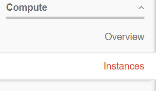
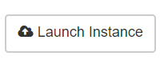
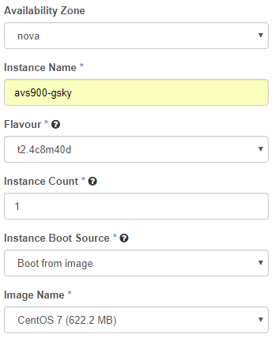
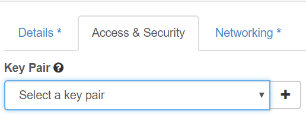
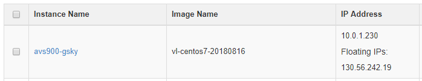
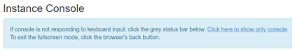

INTRODUCTION
============

This document is a detailed instruction set for creating an instance of a Virtual Machine (VM) on tenjin.nci.org.au and to build the GSKY environment on it. If you have already set it up once, then you may require only the short instructions. To refresh memory, read the TL;DR section or the detailed text.

TL;DR
=====
- Create a VM instance on tenjin.nci.org.au.
	- Choose the option that gives at least 4GB RAM and 80GB disk.
	- Choose CentOS 7 as the operating system.
	- Remember that the VM is accessible only from within NCI network.
	- Use the ethernet for connection when in the office.
	- WiFi through ANU-Secure will not be enough, unless your PC’s IP is added to the firewall.
	- Use VPN to connect from remote locations or from within the office when using the WiFi.
- The GSKY environment must be setup on each new VM.
	- See the short instructions for quick start.
	- See the detailed instructions for components and trouble shooting.
- It takes about 30 minutes to complete, if there are no errors.
	- Ignore the warning messages during the installation.
	- Pay attention to error (crash) and exit messages.
	- If no error, it will display “Completed ALL steps. Exiting!” at the end.
	- Sometimes, after the completion of installation it displays "Segmentation Fault"
		- As yet unsure if it causes any error downstream.
- Sometimes the script crashes for no apparent reason.
	- Re-starting often works to completion.
- Sometimes the OS causes consistent errors during the installation.
	- Re-build the VM with the same OS, and it works.

SHORT INSTRUCTIONS
==================

Build a Virtual Machine
------------
- Go to: https://tenjin.nci.org.au/dashboard/auth/login/
- Login with your NCI username and password.
	- Instances >> Launch Instances >> Specify the details >> Launch
	- Wait at least 10 minutes for the setup to complete.

Build the GSKY environment
----------
- Login to the VM via SSH
- copy the ‘build_all.sh’ to the home dir.
- cd ~
- sudo ./build_all.sh

Do the following if the ‘build_all.sh’ is not provided.

- Login to the VM via SSH
- cd ~
- git clone https://github.com/nci/gsky.git
- cp gsky/install/build_all.sh ~
- sudo ./build_all.sh
	
------------------

DETAILED INSTRUCTIONS
==================

Build a Virtual Machine
-------------------------

The VM instances on https://tenjin.nci.org.au/dashboard/project/instances/ are where the GSKY installation and servers are built and managed.

- Go to https://tenjin.nci.org.au/dashboard/project/
	- Click on ‘Instances’ and then on ‘Launch Instance’



 

- Fill in details as per the example below.

 

- Create/choose a key pair if you wish to use it for password-less login. Otherwise, leave it as blank.*
	- Click the + icon to create a new key pair.
	
 

- Create the instance by clicking ‘Launch’

 

- Wait 10 min for the installation to complete.
- Click on the instance name.

 

 - Click on ‘Console’ tab and then on the hypertext link, “Click here…”
 
 

 

- Login with NCI username/password when prompted. 
	- This is now a regular VM console.
- Add your IP address to the iptables.
	- If you are on the NCI network, either through ethernet or VPN, this step is not required.
		- sudo -i
		- cd /etc/puppetlabs/code/environments/production/hieradata/node/
		- cat > [vm name].yaml (e.g. siva-gsky.yaml)
			- insert the following.
			- nci::firewall::ruleset::ssh::sources_array:
			- – “130.56.84.195” 
				- Tip: Find your IP address:
					- ipconfig (Windows IPv4 address) 
					- ifconfig | awk '/inet / {print}' in Linux
		- OR 
			- vim siva-gsky.yaml
			- Change the IP address to your own as per the example below.
				- – “130.56.84.195”
		- puppet-apply
		- iptables –list

Create an SSH key pair:
=================
NOTE: You will only need this if intending to login and/or transfer files between the VM and another Unix server. There is not much use of it under Microsoft Windows, as ‘putty’ and ‘winscp’ cannot use the openssh keys. Converting them to putty key (*.ppk) does not work either, as the VM does not recognise it. 

To create:
-------------
- SSH to your “home machine”
	- ssh-keygen -t rsa -f username.key
- Copy the content of ‘username.key.pub’ and paste it into the box.
- Keep the ‘username.key’ safely and securely.
-------------------

Build the GSKY environment
--------------------------

In order to run an OWS server, it is required to install GSKY and its dependencies on the VM. This step is required on each new VM being created.

-	Install the dependencies and GSKY environment.
-	Use the 'build_all.sh' provided or clone the git repo from below.
	- copy the ‘build_all.sh’ to the home dir.
	- cd ~
	- sudo ./build_all.sh
OR, clone it under your username so that files can be edited by yourself.
-	cd ~
-	git clone https://github.com/nci/gsky.git
	- cp gsky/install/build_all.sh ~
	- sudo ./build_all.sh

This will take several minutes to complete. It is normal to see many warning messages. Ignore the warnings, but make sure that there is no fatal error. If installation goes to completion, it will display “Completed ALL steps. Exiting”

COMPONENTS AND COMMANDS
-----------------------

-	**sudo -i**

This command starts a super user session using the current shell (e.g. /bin/bash) so that all system commands can be run without having to do a ‘sudo command’ every time. This method, however, has the disadvantage that you are now not in your username’s login shell and therefore the environments, aliases, etc. for your shell are not available. Another risk is that now you are a super user and can accidentally delete/modify things you could not have done before. The safe way is to use ‘sudo command’. For this, avoid the ‘sudo -i’ and prepend ‘sudo’ to all the commands shown below.

- **./build_all.sh**

This script installs several dependencies as given below. It is required to run this script only once.

- **yum groupremove "Development Tools"**

Remove the previously installed programs, if any, so that the latest versions will be installed when the next command is run.

- **yum groupinstall "Development Tools"** [[Ref](https://serverfault.com/questions/274279/whats-the-difference-between-yum-groupinstall-vs-regular-yum-install)]

The groupinstall command installs a bundle of packages that are designated as a group so that you don't need to install a bunch of individual packages yourself to have all of the features. So, yum groupinstall "Development Tools" would install a bunch of packages necessary for development, such as gcc, make, git, etc.

yum grouplist will list the possible groups. yum groupinfo groupname will show what packages are members of groupname (you will need "quotes" if there are spaces in the group name).

The regular install just installs individual packages (and their dependencies) by name.

The following programs are not part of the “groupinstall Development Tools” and, therefore, must be installed separately.

- **yum install wget**
The program, ‘wget’, is used to get several packages required for GSKY. 

- **yum install cmake**
cmake - Cross-Platform Makefile Generator.

- **yum install python-devel**
An include file, Python.h’, is required. It comes from this package.

- **yum install readline-devel**
This is required for PostGreSQL installation.

After the above common dependencies are installed, we must install the following which are specific for GSKY.

- **1.	Independent JPEG Group's free JPEG software** [[Ref](http://www.ijg.org/files/README)]

	```
	prefix=${PREFIX:-/usr}
	v=9c
	(
		set -xeu
		wget -q http://www.ijg.org/files/jpegsrc.v${v}.tar.gz
		tar -xf jpegsrc.v${v}.tar.gz
		cd jpeg-${v}
		./configure --prefix="$prefix"
		make -j4
		make install
	)
	rm -rf jpeg-${v}
	rm -f jpegsrc.v${v}.tar.gz
	```

This package contains the C software to implement JPEG image encoding, decoding, and transcoding.  JPEG is a standardized compression method for full-colour and grayscale images.

The distributed programs provide conversion between JPEG JFIF format and image files in PBMPLUS PPM/PGM, GIF, BMP, and Targa file formats.  The core compression and decompression library can easily be reused in other programs, such as image viewers.  The package is highly portable C code; we have tested it on many machines ranging from PCs to Crays. jpegsrc.vN.tar.gz contains source code, documentation, and test files for release N in Unix format.

- **2.	OPENJPEG Library and Applications** [[Ref](https://github.com/uclouvain/openjpeg/blob/master/README.md)]

```
v=2.3.0
(
	set -xeu
	wget -q -O openjpeg-v${v}.tar.gz https://github.com/uclouvain/openjpeg/archive/v${v}.tar.gz
	tar -xf openjpeg-v${v}.tar.gz
	cd openjpeg-${v}
	mkdir build
	cd build
	cmake .. -DCMAKE_BUILD_TYPE=Release -DCMAKE_INSTALL_PREFIX="$prefix"
	make -j4
	make install
)
rm -rf openjpeg-${v}
rm -f openjpeg-v${v}.tar.gz
```

OpenJPEG is an open-source JPEG 2000 codec written in C language. It has been developed in order to promote the use of JPEG 2000, a still-image compression standard from the Joint Photographic Experts Group (JPEG). Since April 2015, it is officially recognized by ISO/IEC and ITU-T as a JPEG 2000 Reference Software.

`NOTE: The above link appears to be an older version that has been archived. Their latest release has a different tar structure. The current ‘build_deps.sh’ is unable to use that archive. It is not known whether we specifically need the presumably older release.`

- **3.	GEOS - Geometry Engine, Open Source** [[Ref](https://www.osgeo.org/projects/geos/)]
 
```
v=3.6.2
(
	set -xeu
	wget -q http://download.osgeo.org/geos/geos-${v}.tar.bz2
	bunzip2 geos-${v}.tar.bz2
	tar -xf  geos-${v}.tar
	cd geos-${v}
	./configure --prefix="$prefix"
	make -j4
	make install
)
rm -rf geos-${v}
rm -f geos-${v}.tar
```

**GEOS (Geometry Engine - Open Source)** is a C++ port of the Java Topology Suite (JTS). As such, it aims to contain the complete functionality of JTS in C++. This includes all the OpenGIS Simple Features for SQL spatial predicate functions and spatial operators, as well as specific JTS enhanced topology functions.

Capabilities
------------
-	Geometries: Point, LineString, Polygon, MultiPoint, MultiLineString, MultiPolygon, GeometryCollection
-	Predicates: Intersects, Touches, Disjoint, Crosses, Within, Contains, Overlaps, Equals, Covers
-	Operations: Union, Distance, Intersection, Symmetric Difference, Convex Hull, Envelope, Buffer, Simplify, Polygon Assembly, Valid, Area, Length,
-	Prepared geometries (pre-spatially indexed)
-	STR spatial index
-	OGC Well Known Text (WKT) and Well-Known Binary (WKB) encoders and decoders.
-	C and C++ API (C API gives long term ABI stability)
-	Thread safe (using the re-entrant API)

NOTE: The v3.6.2 being downloaded in the script is an older version (2017). Latest stable release is 3.7.0 (Sep 2018)


